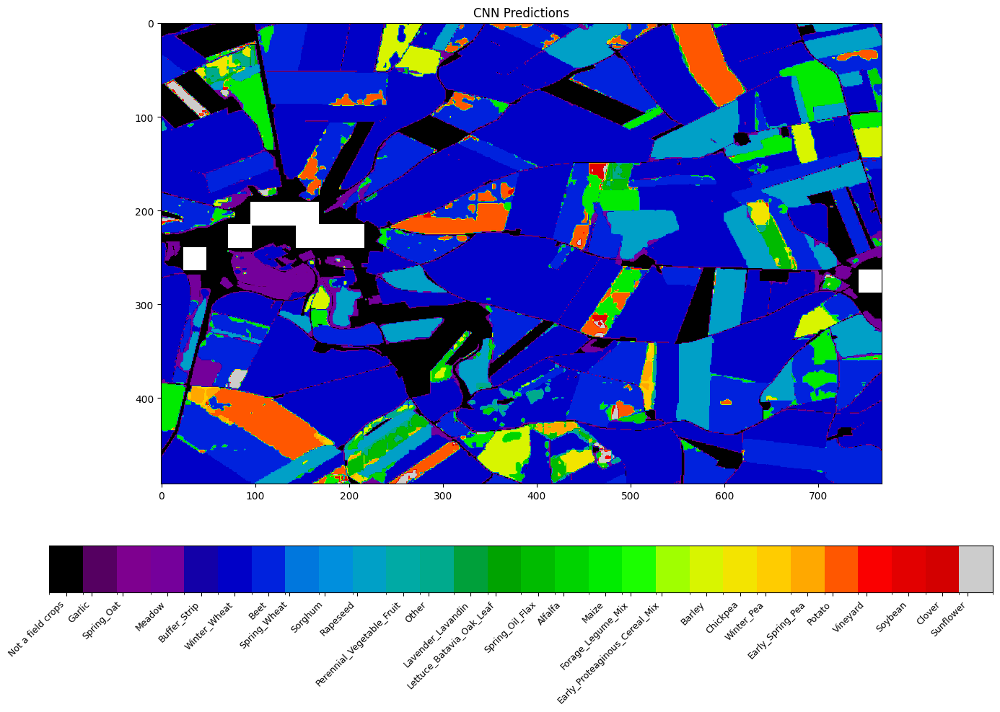
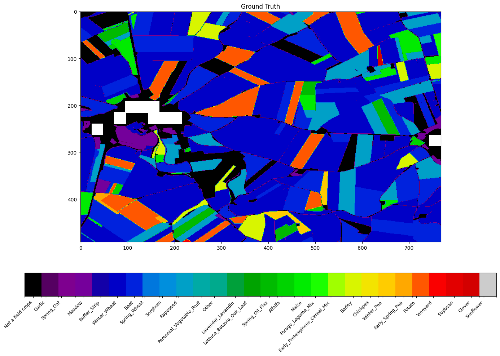

# Crop mapping from multispectral image time series: deep learning

## Dataset Description

### Ground Truth (Crop Labels) 

#### Data description

For ground truth values, we utilize the 2023 Graphical Parcel Register (RPG) as the reference source. This dataset, provided as a shapefile, consists of polygons that precisely delineate agricultural parcels. Each polygon corresponds to an individual field and contains essential information: a unique identifier, its surface area measured in hectares (HA), and the identifier of the predominant crop grown on it during the 2023 cultivation season. The area covered is the entire contry with a total number of 9 797 405 parcels.

- [online visualisation](https://www.geoportail.gouv.fr/donnees/registre-parcellaire-graphique-rpg-2023)
- [downloading link](https://data.geopf.fr/telechargement/download/RPG/RPG_2-2__GPKG_LAMB93_FXX_2023-01-01/RPG_2-2__GPKG_LAMB93_FXX_2023-01-01.7z)

#### Data cleaning 

We needed to clean the predominant crop identifier from the Registre Parcellaire Graphique (RPG) data. While the RPG encoding is useful for the Common Agricultural Policy (PAC), it isn't ideal for our classification task.

For instance, the RPG distinguishes between "sweet maize" and "maize" with separate crop IDs. However, these two share a nearly identical spectral signature, making their separation irrelevant for our classification purposes. This initial RPG classification also results in an excessively large number of classes.

By using the classes defined by [Turkoglu et al.](https://arxiv.org/pdf/2102.08820), we leverage an expert-crafted set of more meaningful and spectrally distinct crop categories. This approach effectively addresses the over-granularity of the RPG, merging spectrally similar crops (like sweet maize and maize) into single, relevant categories, and significantly reducing the total number of classes to a practical size for our classification.

We also reprojected the CRS of parcel geometries (Lambert 93 : EPSG:2154) to match Sentinel-2's projection system (WGS84: reproject each tile to its native UTM zone ), guaranting accurate overlay.

### Satellite Data

We rely on Sentinel-2 Level-2A (Surface Reflectance) images: [Harmonized Sentinel-2 MSI: MultiSpectral Instrument, Level-2A (SR)](https://developers.google.com/earth-engine/datasets/catalog/COPERNICUS_S2_SR_HARMONIZED?hl=fr)

We leverages 4 spectral bands from Sentinel-2 satellites to perform crop detection. These bands allow us to extract detailed information about vegetation based on light reflectance at specific wavelengths.

#### The following bands are used:

| Band | Name  | Resolution | Wavelength (S2A / S2B) | Description                                         |
| ---- | ----- | ---------- | ---------------------- | --------------------------------------------------- |
| B2   | Blue  | 10 m       | 496.6 / 492.1 nm       | Chlorophyll detection, cloud cover analysis         |
| B3   | Green | 10 m       | 560 / 559 nm           | Vegetation contrast, plant health analysis          |
| B4   | Red   | 10 m       | 664.5 / 665 nm         | NDVI calculation, vegetation growth tracking        |
| B8   | NIR   | 10 m       | 835.1 / 833 nm         | Biomass detection, distinguishes soil vs vegetation |

#### Data cleaning 

To effectively manage clouds in our satellite imagery, we leverage the Scene Classification Layer (SCL) provided by Sentinel-2. The SCL is a band within the Sentinel-2 Level-2A product that classifies each pixel based on its content (e.g., cloud, shadow, vegetation, water, snow). We use this layer to mask out all pixels not classified as vegetation, bare soil, or water (SCL classes 4 to 7), ensuring that clouds, cloud shadows, and other atmospheric artifacts are excluded from our analysis.

Following the SCL masking, we compute a pixel-wise median for each month. Since each month provides between 6 and 15 images per band for a given area, the median composite is highly robust. We choose the median over the mean because it is significantly less impacted by outliers that might persist even after SCL masking (e.g., residual cloud edges or noise). This process also reduces the probability of having "absent pixels" due to clouds in our monthly composites.

While median compositing greatly minimizes cloud-induced gaps, some might still occur. To address these, we implemented a pixel-wise temporal interpolation strategy:

- For a missing pixel value in a given month: The new value is calculated as the mean of the corresponding pixel's value from the previous month and the next month.
- For missing values in the first month of the time series: We use the next available monthly value for that pixel.
- For missing values in the last month of the time series: We use the last available previous monthly value for that pixel.

Although this interpolation involves a nasty function with many for loops, it proves to be quite powerful in generating a complete and continuous time series of satellite imagery.

### Data sampling 

Due to the extensive size of the covered area in France, we had to reduce the dataset used for modeling. To achieve this, we selected specific zones representing distinct agricultural landscapes, characterized by predominant crops and farming practices influenced by varying pedoclimatic conditions.

The following table lists these key agricultural zones across France, alongside nearby towns for geographic reference:

| Zone                            | Region                 | Nearby Town (Map Reference) | Notes                                                         |
| ------------------------------- | ---------------------- | --------------------------- | ------------------------------------------------------------- |
| **Nord-Picardie**               | Hauts-de-France        | **Saint-Quentin** (Aisne)   | Surrounded by large-scale crops (wheat, sugar beet, potatoes) |
| **Paris Basin**                 | Île-de-France / Centre | **Chartres** (Eure-et-Loir) | Heart of the Beauce, vast cereal plains                       |
| **Brittany / Pays de la Loire** | Brittany / Vendée      | **Vitré** (Ille-et-Vilaine) | Mixed zone: livestock, silage maize, hedgerows                |
| **Southwest**                   | Nouvelle-Aquitaine     | **Auch** (Gers)             | Cereal polyculture, maize, sunflower                          |
| **Southeast**                   | Provence, Rhône-Alpes  | **Carpentras** (Vaucluse)   | Vineyards, orchards, greenhouse vegetable farming             |
| **Massif Central**              | Auvergne               | **Riom** (Puy-de-Dôme)      | Limagne plain: polyculture on volcanic plains                 |
| **Alsace  / Lorraine**           | Grand Est              | **Colmar** (Haut-Rhin)      | Hillside vineyards + lowland crop farming                     |
| **Mediterranean**               | Occitanie, PACA        | **Béziers** (Hérault)       | Vineyards, olive trees, vegetable crops, dry climate          |

We used ESA WorldCover (10 m resolution, global) to identify highly cultivated areas for sampling. From these representative landscapes, we selected five 10 km×10 km zones around each. This resulted in a total dataset covering 40 zones (8 regions × 5 zones each), each spanning 100 km^2.

 We then extracted all parcels from the 2023 RPG that intersect with these zones, totaling 130,000 parcels with an average size of 1.5 HA. 
And retrieve computed median satellites images of teh studied zones for each month via the google earth engine API. 

# Models 

## Deep Learning Model Overview : 

Our model classifies each pixel of a multispectral time-series image into crop types by combining temporal and spatial feature extraction in a hybrid CNN architecture.

Input:
X ∈ ℝ^[B, C=4, T, H, W] — a batch of multispectral sequences with 4 channels (e.g., Red, Green, Blue, NIR), T time steps, and spatial dimensions H×W.

#### Step 1: Temporal Encoding (Pixel-wise)

Reshape input to [B × H × W, C, T].
Apply a 1D CNN independently on each pixel’s temporal sequence.
This captures temporal patterns per pixel across spectral bands and outputs D-dimensional embeddings.

#### Step 2: Reshape to Spatial Grid

Reshape back to [B, D, H, W], forming a pseudo-image from the temporal embeddings.

#### Step 3: Spatial Encoding (Image-wise)

Pass through a 2D CNN backbone (a simplified U-Net).
This captures spatial context and relationships between neighboring pixels.

#### Step 4: Classification

The final output is per-pixel class logits with shape [B, num_classes, H, W].

#### Results : 

## biblio 

Turkoglu, M. O., D'Aronco, S., Perich, G., Liebisch, F., Streit, C., Schindler, K., & Wegner, J. D. (2021).  
*Crop mapping from image time series: deep learning with multi-scale label hierarchies*.  
Remote Sensing of Environment, 264. Elsevier.  
